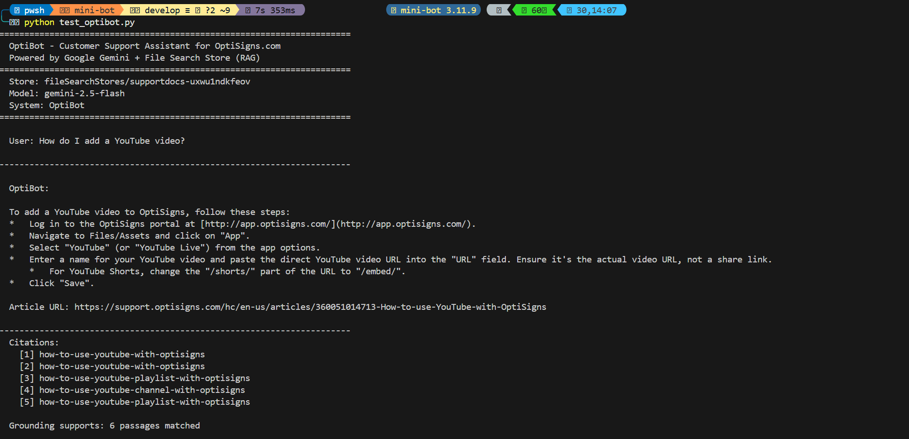

# Echo-Vault: Support Article Scraper & Gemini RAG Pipeline

Echo-Vault is a pipeline that scrapes Zendesk support articles, converts them to Markdown, and synchronizes them to Google Gemini's File Search Store for RAG-based AI retrieval.

### Chunking Strategy
We leverage **Google Gemini's Managed Semantic Chunking** via the File Search API. Rather than splitting text manually, the Gemini API automatically processes the uploaded Markdown files, dynamically splitting them into chunks that respect semantic boundaries (like headings, lists, and paragraphs) and indexing them using the `gemini-embedding-2` model for optimal RAG retrieval.

## 1. Setup

### Installation
```bash
git clone https://github.com/abcdefghuy/mini-bot-echo-vault.git
cd mini-bot-echo-vault
python -m venv .venv
.venv\Scripts\activate        # Windows
# source .venv/bin/activate   # macOS/Linux
pip install -r requirements.txt
```

### Configuration
Copy `.env.sample` to `.env` and fill in the required variables:
```bash
cp .env.sample .env
```
* **Required environment variables:**
  * `GEMINI_API_KEY`: Your Google Gemini API key (from [Google AI Studio](https://aistudio.google.com/apikey))
  * `SUPPORT_BASE_URL`: Zendesk help center base URL (`https://support.optisigns.com`)
  * `OUTPUT_DIR`: Directory to save the scraped articles (`articles`)
  * `HASH_STORE_FILE`: File to track scraper hashes (`article_hashes.json`)
  * `UPLOAD_HASHES_FILE`: File to track uploader hashes (`upload_hashes.json`)

---

## 2. How to Run Locally

* Run the **full pipeline** (scrape new articles + upload delta to Gemini File Search Store):
  ```bash
  python main.py
  ```
* Run **scraper only** (scrapes Zendesk to local Markdown files):
  ```bash
  python main.py --scrape
  ```
* Run **uploader only** (uploads local changes to Gemini File Search Store):
  ```bash
  python main.py --upload
  ```
* Run **assistant verification query** (test Gemini RAG grounding):
  ```bash
  python test_optibot.py
  ```

### Running with Docker

* **Build the Docker image:**
  ```bash
  docker build -t mini-bot-pipeline .
  ```
* **Run the pipeline (Single execution, exits 0 on success):**
  ```bash
  docker run -e GEMINI_API_KEY="your_gemini_api_key" mini-bot-pipeline
  ```
* **Run with Delta Sync (Using volume mount to persist cache hashes):**
  ```bash
  docker run -v "${PWD}/data:/data" -e GEMINI_API_KEY="your_gemini_api_key" -e HASH_STORE_FILE="/data/article_hashes.json" -e UPLOAD_HASHES_FILE="/data/upload_hashes.json" -e OUTPUT_DIR="/data/articles" mini-bot-pipeline
  ```

---

## 3. Daily Job & Logs

This pipeline is automated to run as a scheduled daily cron job on **GitHub Actions** (running at 02:00 AM Indochina Time daily) to keep the search store in sync. 

* **Daily Job Logs:** You can view the live execution logs and status of all runs at:
  👉 [GitHub Actions Execution Logs](https://github.com/abcdefghuy/mini-bot-echo-vault/actions)

---

## 4. Grounding Assistant Test Results

Below is the screenshot of our grounding assistant (**OptiBot**) answering the sample question *"How do I add a YouTube video?"* with grounding citations fetched from the uploaded Gemini File Search Store:


